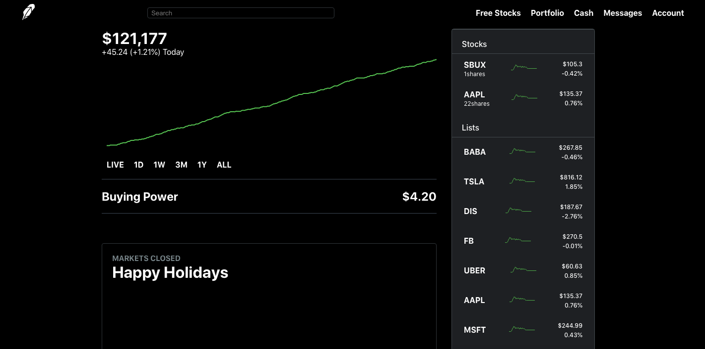

# Robinhood Clone



> Robinhood clone live demo here (https://robinhood-a490a.web.app/)

---

### Table of Contents

- [Description](#description)
- [How To Use](#how-to-use)
- [References](#references)
- [License](#license)
- [Author Info](#author-info)

---

## Description

Robinhood clone was created for learning purposes to better understand React. Real time live demo deployed with Firebase. Stocks data is pulled from Finhub Trading API. Flexbox and BEM syntax was used for styling compenents. 

#### Technologies

- React
- Firebase
- CSS
- HTML
- Node

#### Dependencies

- "@material-ui/core": "^4.11.1",
- "@material-ui/icons": "^4.9.1",
- "@reactchartjs/react-chart.js": "^1.0.0-rc.3",
- "@testing-library/jest-dom": "^5.11.4",
- "@testing-library/react": "^11.1.0",
- "@testing-library/user-event": "^12.1.10",
- "axios": "^0.21.1",
- "chart.js": "^2.9.4",
- "firebase": "^8.2.3",
- "react": "^17.0.1",
- "react-chartjs-2": "^2.11.1",
- "react-dom": "^17.0.1",
- "react-scripts": "4.0.1",
- "web-vitals": "^0.2.4"

[Back To The Top](#robinhood-clone)

---

## How To Use

#### Installation

- `git clone https://github.com/trilamanila/robinhood`
- `npm install`

#### API Reference

```Javascript
const firebaseApp = firebase.initializeApp(firebaseConfig);

const db = firebaseApp.firestore();

const BASE_URL = "https://finnhub.io/api/v1/quote";
```
[Back To The Top](#robinhood-clone)

---

## References
[Back To The Top](#robinhood-clone)

- Twitter - [@trilamanila](https://twitter.com/trilamanila)
- Website - [Trilamanila](https://trilamanila.com)
---

## License

MIT License

Copyright (c) [2021] [Joncin Picol]

Permission is hereby granted, free of charge, to any person obtaining a copy
of this software and associated documentation files (the "Software"), to deal
in the Software without restriction, including without limitation the rights
to use, copy, modify, merge, publish, distribute, sublicense, and/or sell
copies of the Software, and to permit persons to whom the Software is
furnished to do so, subject to the following conditions:

The above copyright notice and this permission notice shall be included in all
copies or substantial portions of the Software.

THE SOFTWARE IS PROVIDED "AS IS", WITHOUT WARRANTY OF ANY KIND, EXPRESS OR
IMPLIED, INCLUDING BUT NOT LIMITED TO THE WARRANTIES OF MERCHANTABILITY,
FITNESS FOR A PARTICULAR PURPOSE AND NONINFRINGEMENT. IN NO EVENT SHALL THE
AUTHORS OR COPYRIGHT HOLDERS BE LIABLE FOR ANY CLAIM, DAMAGES OR OTHER
LIABILITY, WHETHER IN AN ACTION OF CONTRACT, TORT OR OTHERWISE, ARISING FROM,
OUT OF OR IN CONNECTION WITH THE SOFTWARE OR THE USE OR OTHER DEALINGS IN THE
SOFTWARE.

[Back To The Top](#robinhood-clone)

---

## Author Info

- Twitter - [@trilamanila](https://twitter.com/trilamanila)
- Website - [Trilamanila](https://trilamanila.com)

[Back To The Top](#robinhood-clone)
